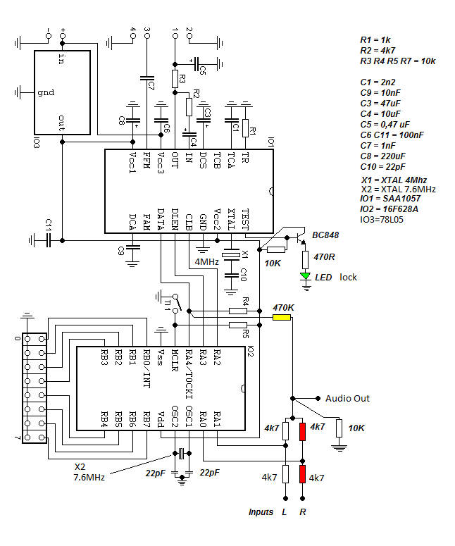

# SAA1057 Stereo PLL Controller

## Description

A MikroC code that provides functions to configure and operate the SAA1057 PLL integrated circuit.

## Schematic

## Features

- **PLL Control Functions**: Functions to set frequency shifts, data configuration, and more.
- **Configuration**: Easy-to-use API for setting up pins and operating modes.
- **DIP Switch Integration**: Support for configuring pins via DIP switches.

## Requirements

- **MikroC Pro for PIC**: To compile the source code.
- **Hardware**: SAA1057 PLL circuit integrated, PIC16F628A Microcontroller.
- **time base**: 7.6MHz and 4MHz xtals.

## Installation

1. Download the repository from GitHub:
   [https://github.com/junon10/saa1057-stereo-pll](https://github.com/junon10/saa1057-stereo-pll)

2. Open the project file with 'MikroC Pro for PIC' and compile.

3. Write the Hex file to the 16F628A microcontroller using a compatible programmer, e.g. 'Pickit3'.

4. Connect the PLL board to a VCO, set the frequency on the dipswitch, and power the circuit.

## Limitations

- For detailed technical specifications, refer to the SAA1057 datasheet.

## Author

- **Junon M.**  
  Contact: [junon10@tutamail.com](mailto:junon10@tutamail.com)

## Contributing

Contributions are welcome! Please fork the repository and send a pull request.

## Repository

- [https://github.com/junon10/saa1057-stereo-pll](https://github.com/junon10/saa1057-stereo-pll)

## References

- SAA1057 Datasheet
- PIC16F628A Datasheet 

## Changelog

- **v1.0.0 (2011/09/15)**: Initial commit.

## License

- GPLv3

